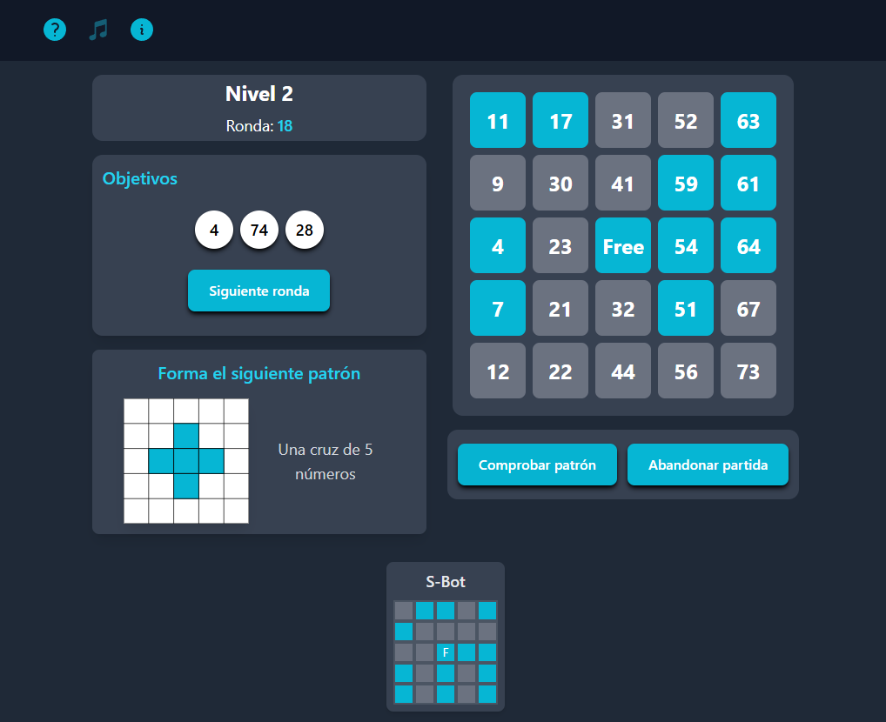

# Bingo-App-1.0

Demo de videojuego de Bingo con Bots simulados con React.

Tecnologias utilizadas: HTML, TailwindCSS, TypeScript, React
Librerias utilizadas: HeroIcons, HeadlessUI y ToneJS

Historial de versiones:

1.0: 08/01/2025

- Implemente un reproductor de musica con ToneJS
- El jugador y cada uno de los bots solamente podrian tener 1 solo tablero
- Tiene más de 5 niveles

1.1: 19/01/2025

- Puedes desbloquear hasta 20 niveles
- Algunos niveles tiene 2 tableros para el jugador
- No es adaptable a dispositivos moviles

Versión de prueba: [Haga clic aqui para jugar](https://stately-hummingbird-3bc0f1.netlify.app/)

## Captura de pantalla

